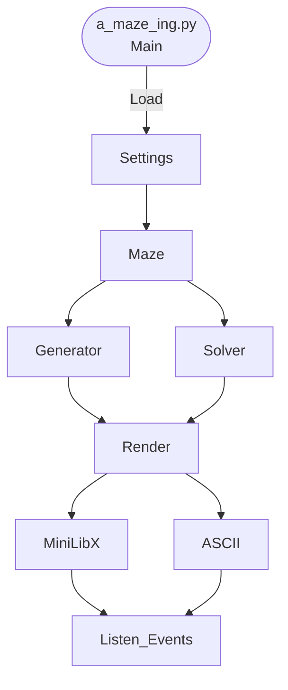

# Amazing 

## Structure:

```
maze_generator/
│
├── README.md
├── requirements.txt
├── settings.json
├── main.py
│
├── assets/  (Optional) -> graphic resources
│   ├── images/ 
│   ├── textures/
│   ├── fonts/
│   └── icons/
│
├── config/  -> Related to select and load confg.
│   ├── __init__.py
│   ├── loader.py
│   ├── validator.py
│   └── defaults.py
│
├── maze/  -> Maze data structure (Class)
│   ├── __init__.py
│   │
│   ├── model.py
│   ├── cell.py
│   ├── grid.py
│   │
│   ├── generator.py
│   ├── solver.py
│   ├── validator.py
│   └── exporter.py
│
├── algorithms/  -> Algorithms insolated.
│   ├── __init__.py
│   │
│   ├── generation/
│   │   ├── recursive_backtracker.py
│   │   ├── prim.py
│   │   ├── kruskal.py
│   │   ├── eller.py
│   │   ├── wilson.py
│   │   └── hunt_and_kill.py
│   │
│   └── solving/ /  (1)  -> Solving classes
│       ├── bfs.py
│       ├── dfs.py
│       ├── astar.py
│       ├── dijkstra.py
│       └── wall_follower.py
│
├── graphics/   ->  MiniLibX stuff (Maybe for ASCII??)
│   ├── __init__.py
│   ├── window.py
│   ├── renderer.py
│   ├── colors.py
│   ├── camera.py /  (Optional)
│   ├── events.py
│   ├── animation.py
│   └── mlx_wrapper.py
│
├── io/  (Optional) -> Exporting files (img, txt, etc)
│   ├── __init__.py
│   ├── save_png.py
│   ├── save_json.py
│   ├── load_json.py
│   └── logger.py
│
├── utils/  -> Specials to use if required.
│   ├── randomizer.py
│   ├── timer.py   /  (Optional)
│   ├── geometry.py  /  (Optional)
│   └── constants.py
│
├── tests/    (Optional)
│   ├── test_generation.py
│   ├── test_solver.py
│   ├── test_settings.py
│   └── test_renderer.py
│
└── examples/  (Optional)
    ├── tiny.json
    ├── medium.json
    └── huge.json
```

## Proccess:

1. Load settings
2. Validate settings
3. Create Grid (size)
4. Load Algorithm
5. Generate maze.
6. Generate solution.
7. Load in MiniLibX window.
8. Draw maze.
9. Draw solution
10. Listen user imputs.

## Relation Class:




## Duties:

- [ ] () Load Settings
- [ ] () Generate windows
- [ ] () Algorithm Gener: Recursive Backtracker
- [ ] () Algorithm Gener: Prim
- [ ] () Algorithm Gener: Kruskal
- [ ] () Algorithm Gener: eller
- [ ] () Algorithm Gener: wilson
- [ ] () Algorithm Gener: hunt_and_kill
- [ ] () Algorithm 
- [ ] () Algorithm 
- [ ] () Algorithm 
- [ ] () Algorithm 
- [ ] () Algorithm 
- [ ] () Algorithm 

- [ ] () Generate maze


MODUlE (visual)
module (parameters)
exucte|
algorithms

(OPTIONAL): Menu to change configuration inside app and save it.

## Specifications:

### Specifics
- [ ] Maze generator in Python (1 single perfect path)
- [ ] Work by reading a confg file: `config.txt`
- [ ] Write file using hexadecimal wall representation.
- [ ] Imput: `python3 a_maze_ing.py config.txt`.
- [ ] Main: `a_maze_ing.py`.
- [ ] Randomly by seeds.
- [ ] By Cells (with 0 - 4 walls)
- [ ] Entry and exit inside maze bounds.
- [ ] Coherent data generated (Related walls between cells)
- [ ] Not corridors > 2 cells.
- [ ] Not larger empty areas than 3x3.
- [ ] 42 representation (closed cells) if is space.
- [ ] PERFECT flag for generate 1 possible path.
- [ ] ASCII or MiniLibX library (Visual)
- [ ] User interactions:
    - [ ]  Re-generate new maze.
    - [ ] Show/hide shortest path.
    - [ ] Change walls colours.
    - [ ] Set color for 42

- [ ] Bonus:
    - [ ] Multiple maze generator algorithms.
    - [ ] Animations during maze generation.

### Output:

3: 0011   ─┐   A: 1010          NESW
           │e          w│  │e

ABC34BCA4  -> row inf.
BCA4ABC2A
BBC34CA4B
14BDFEEAB

1, 1      -> entry coords
5, 3      -> exit coords
SWSSENW   -> shortest path

*All ends with /n


- Cells (row by row)
- Sep by empty line: Entry, exitd coords + shortest way with NESW
### General
- [ ] Handle all possible errors (try-except)
    - Files
    - Connections
    - Inputs
    - Key catchs
    - Impossible parameters.
    - Syntax errors.
- [ ] Context managers for external resources -> Auto Cleanup
- [ ] Flake8
- [ ] Mypy --strict
- [ ] Docstrings:
    - PEP 257 (Google | NumPy style)
    - Definition functions, Class, Methods (public)
    - Designed to info when `-h` or `help`.
    - `""" Do X and return a list. """` -> Example.
    - `""" function(a, b) -> list"""` -> Only for C code.
    - Extra information: args, returns, side effects, exceptions or restrictions.
    - Use `override when subclasses remplace superclass methods.
    - Use `extend` when calls superclass method.
- [ ] Makefile:
    - `install` -> dependencies by pip, **uv**, pipx
    - `run` -> Execute main script by pip
    - `debug` -> Run in debug mode like pdb.
    - `clean` -> Remove temp files or cache (__pycache__, .mypy_cache)
    - `lint` -> Execute commands like flake8 or mypy:
        --warn-return-any
        --warn-unused-ignores 
        --ignore-missing-imports 
        --disallow-untyped-defs
        --check-untyped-defs
    - `lint-strict` -> with --strict
- [ ] pytest or unittest
- [ ] `.gitignore` for python artifacts.
- [ ] Use virtual env.
- [ ] Rehusable code (Class inside standalone module)
- [ ] Rehusable code able to pip install -> mazegen-* (allowed .tar.gz and .whl)
- [ ] Docs with:
    - [ ] Init and use maze instructions.
    - [ ] Pass custom parameters.
    - [ ] Access to generate structure and least 1 solution.
    - [ ] Structure, format of config file.
    - [ ] Maze generator algorith
    - [ ] WHy got this algorithm
    - [ ] What and how use reusable code
    - [ ] Roles for each team member
    - [ ] Anticipate planning and project development.
    - [ ] What works well and what can be improved
    - [ ] Specific tools used.


### Config Document:
Use KEY=VALUE.
#Comment inside document.

| Key | Description | Example
| :---  | :--- | :--- |
| WIDTH | Maze width (number of cells) | WIDTH=20
| HEIGHT | Maze height | HEIGHT=15
| ENTRY | Entry coordinates (x,y) | ENTRY=0,0
| EXIT | Exit coordinates (x,y) | EXIT=19,14
| OUTPUT_FILE | Output filename | OUTPUT_FILE=maze.txt
| PERFECT | Is the maze perfect? | PERFECT=True

(optional: Algorithms, display mode, seeds):

| Key | Description | Example
| :---  | :--- | :--- |
| GENERATOR | Algorithm | GENERATOR=Prim
| SEED | Seed to generate | SEED=null
| ANIMATION | Show animation | ANIMATION: True
| SPEED | Speed to show animation | SPEED=300
| WALL | Color for walls | WALL:"#000000"
| FLOOR | Color for floor | FLOOR:"#FFFFFF"
| SOLUTION | Color for solution | SOLUTION:"#00AAFF
| ENTRY | Color for entry | ENTRY:"#00FF00
| EXIT | Color for exit | EXIT:"#ff5100

### Docstring examples:

```python
def kos_root():
    """Return the pathname of the KOS root directory."""  <- Docstrings
    global _kos_root
    if _kos_root: return _kos_root
    ...
```

```python
def complex(real=0.0, imag=0.0):
    """Form a complex number.

    Keyword arguments:
    real -- the real part (default 0.0)
    imag -- the imaginary part (default 0.0)
    """
    if imag == 0.0 and real == 0.0:
        return complex_zero
    ...
```

<span style="color:blue">some *blue* text</span>.


## External Resources:

https://mermaid.ai/open-source/syntax/flowchart.html
https://python-tcod.readthedocs.io/en/latest/tcod/charmap-reference.html